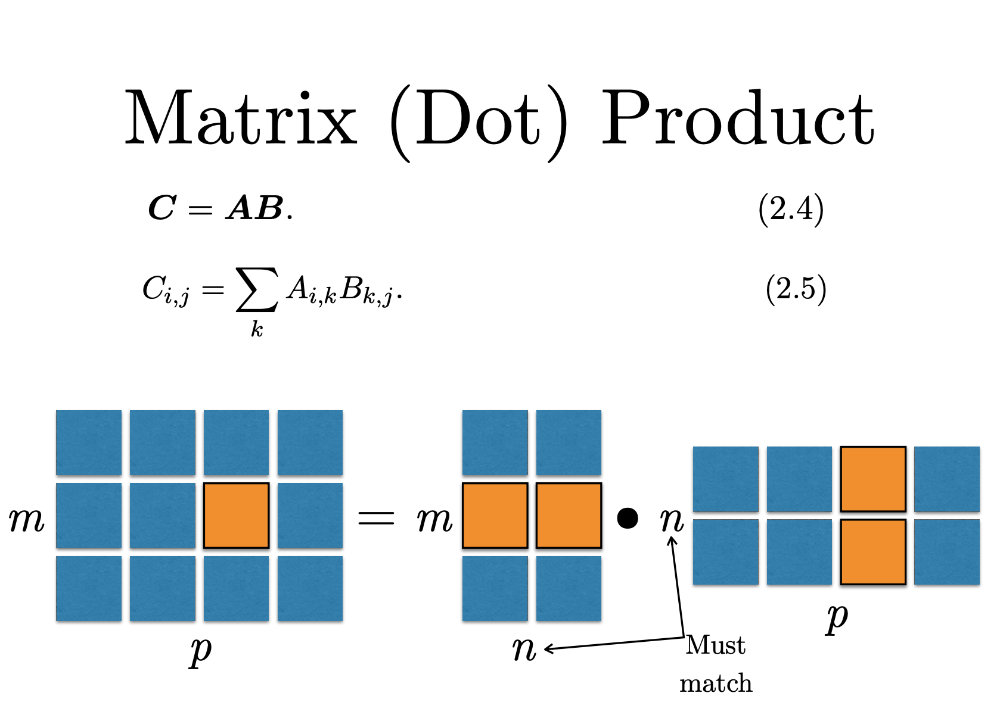
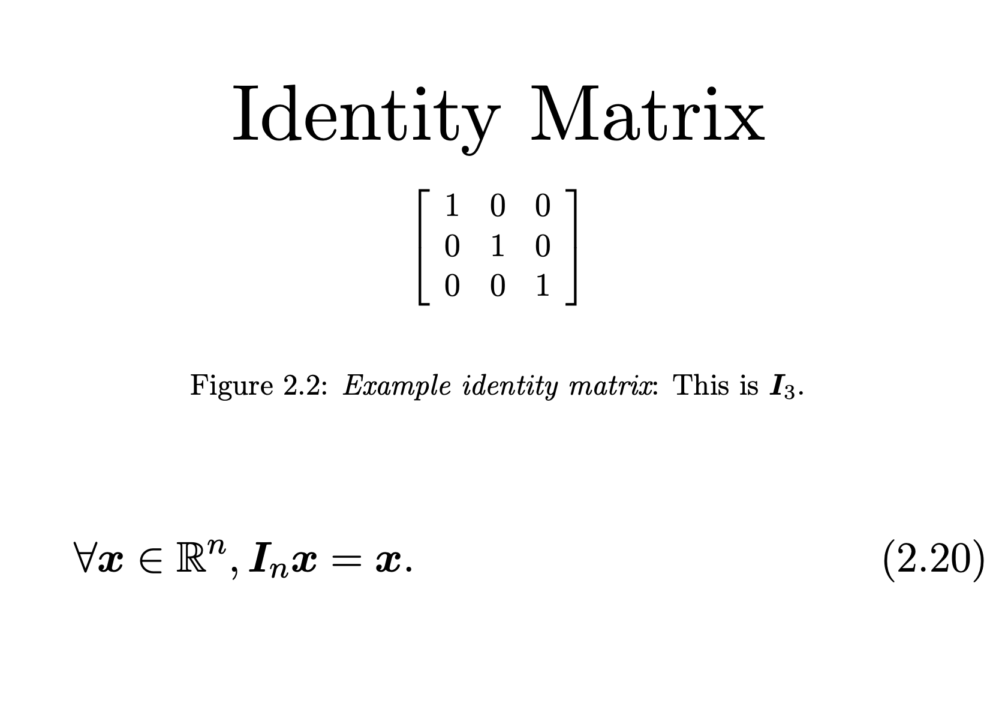

# Linear Algebra

Mathematics is known as the language of the universe. It is because of maths that the universe behaves the way is does. We say that the universe is uncertain, its ways are uneven, but deep in its heart the universe knows what it is doing. Its ways are higher and thoughts are inscrutable. 

Most of them speculate that the universe has its favourite number and that is, 1.618... 

Mathematics as a whole is divided into the following categoricies: 

1.	Classification systems
2.	Major divisions of mathematics
- 2.1	Pure mathematics
  -	Foundations
  -	Number Theory
  -	Algebra
  -	Combinatorics
  -	Geometry and topology
  -	Analysis

 - 2.2	Applied mathematics
    - Probability and statistics
    - Computational sciences
    - Physical sciences
    - Other applied mathematics

Since our aim is to learn artificial intelligence we will only focusing on algebra and more precisely linear algebra.

Linear Algebra is a combination of two words **Linear** and **Algebra**. The latter mean something that is straight and the former means "restoration or completion". Meaning to take one side of the equation to another side of the equation. The idea of algebra came from the ancient babylonians. 

Linear algebra is a branch of mathematics, used widely throughout science and engineering. Yet because linear algebra is a form of continuous rather than discrete mathematics, hence it forms a good tool for physicist, mathematician and even engineers. A good understanding of linear algebra is essential for understanding and workingw ith many machine learning algorithms, especially deep learning algorithms. 

The following are the given important concepts and terms that we will be using throughtout this section. 

## Scalars, Vectors, Matrices and Tensors

  - **Vector** is a 1-dimensional array which represents both direction and magnitude of the vector in a vector space. What is a vector space? Think of a vector as an open field where a point is located. The point is a vector. For you to reach to that point you need two things : one is the latitude and the second is the longitude. A vector is made up of these two coordinates a x-axis and a y-axis. 
  
  The direction is where the point lies in a given vector space whereas the magnitude is like a distance how long is that point from the orgin. 
  
  - Vectors are basically lists which can have infinite elements present in them. 
  - They are 1-dimensional
  - They represents direction and magnitude
  - It is denoted by *x* where **x** belongs to a vector of n rows 
  
  
  **Scalars** on the other hand are the numbers that can change the property of the vector. They are single numbers. A scalar is denoted by italic alphabet *x*
  
  **Matrix** are 2-dimensional rectangular representation of rows and columns. When the vectors are stacked side by we form a matrix. Matrix can have infinite number of vectors in them. 
  
  **Tensors** are matrix with more than two dimensions.  
  
  
  **PS**: To understand these topic more clearly I recommend you to watch a series of video by Grant Sanderson called <a href="https://www.youtube.com/playlist?list=PLZHQObOWTQDPD3MizzM2xVFitgF8hE_ab" target='_blank'> The Essence of Linear Algebra </a>.
  
## Matrix Operations
The whole of the Linear Algebra revolves around two operations Matrix multiplication and addition. It is how we operate them help us to reach a point in a given vector space.

To build a basic intuition regarding these topic I would recomend you to watch <a href = "https://www.khanacademy.org/math/precalculus/x9e81a4f98389efdf:matrices/x9e81a4f98389efdf:properties-of-matrix-multiplication/v/defined-and-undefined-matrix-operations"> Khan's Academy Video on Matrix operations </a>.

 
 
<caption>Courtesy: Deep Learning - Ian Goodfellow and Yoshua Bengio and Aaron Courville</caption>
  
  
  <caption>Courtesy: Deep Learning - Ian Goodfellow and Yoshua Bengio and Aaron Courville</caption>
  
  
 ## System of Linear Algebra
 
 There are three solving system of linear algebra:
    
    - No Solution 
    - Infinite many solution 
    - Only one solution
    
## Matrix Inversion 

If A is a matrix of a given rows and columns when multiplied by an identity matrix is the original matirx A. Which is given by the formula : A*I* = A 

The inverse of the matrix is given by **A.A-1 = *I***.
