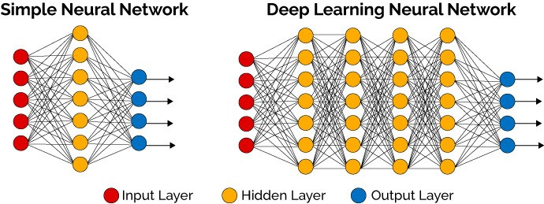

# Deep Learning

This repo is inspired by many authors. Like Andrew Ng, Ian Goodfellow, Lex Fridman and so on.

## Table of Contents
  
  - Intro to Deep Learning
    - What is a neural network?
       - Single neuron == linear regression without applying activation(perceptron)
       
       - Basically a single neuron will calculate weighted sum of input(W.T*X) and then we can set a threshold to predict output in a perceptron. If weighted sum of input cross the threshold, perceptron fires and if not then perceptron doesn't predict.
       
       - Perceptron can take real values input or boolean values.
       
       - Actually, when w⋅x+b=0 the perceptron outputs 0.
        
       - Disadvantage of perceptron is that it only output binary values and if we try to give small change in weight and bais then perceptron can flip the output. We need some system which can modify the output slightly according to small change in weight and bias. Here comes sigmoid function in picture.
        
       - If we change perceptron with a sigmoid function, then we can make slight change in output.
         e.g. output in perceptron = 0, you slightly changed weight and bias, output becomes = 1 but actual output is 0.7. In case of sigmoid, output1 = 0, slight change in weight and bias, output = 0.7.
       
       - If we apply sigmoid activation function then Single neuron will act as Logistic Regression.
        
       - we can understand difference between perceptron and sigmoid function by looking at sigmoid function graph.
       
       - A simple NN graph:
       
 
  
