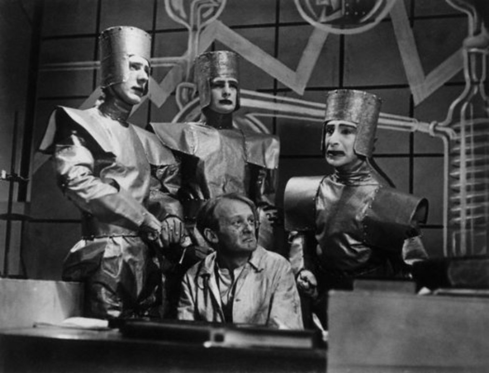
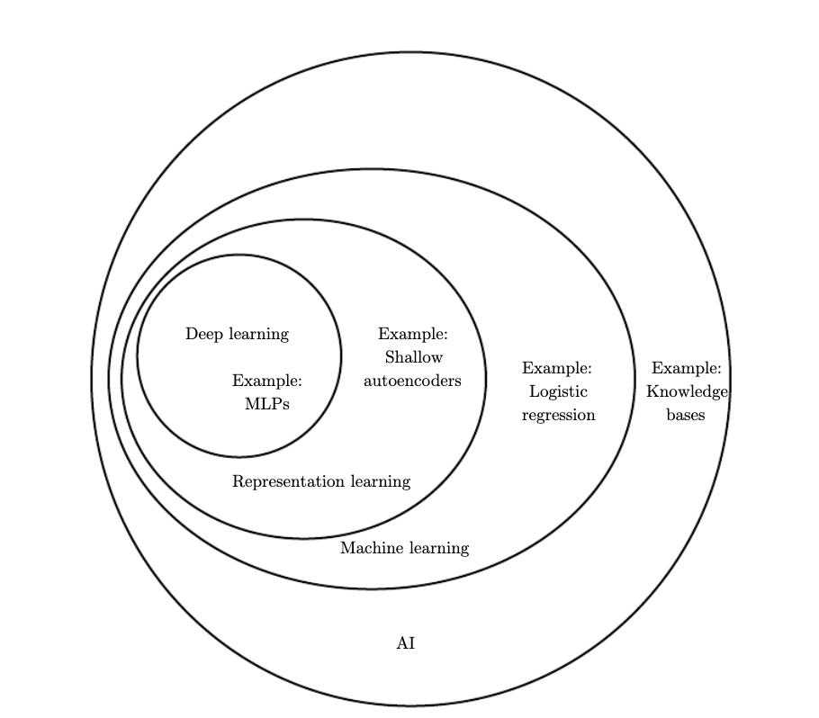

# Content

- Introduction 
- Applied Mathematics using Numpy
    - General Term in Maths
    - Introduction to Numpy
    - Linear Algebra
    - Probability and Statistics
    - Numerial Computation
- Intro to Deep Learning with Keras
    - Intro to CNN
    - Transfer Learning
    - Intro to LSTM
    - Autoencoder
- Intro to CNN with Pytorch
    - Gradient Descent
    - Linear Nets
    - ConvNets - 1 
    - ConvNets - 2
    - Confusion Matrix
- Natural Language Processing with Pytorch
- Modern Approach of Deep Learning
    - Geneartive Adversarial Network
- Unsupervised Learning 
- Reinforcement Learning 

This Program is inspired by (Make sure you read in the order mentioned below in order to get an intuitive knowledge of the subject. Let's Build the Intuition) :

    - Machine Learning for Humans by Vishal Saini and Samir Sabri
    - The Hundred-Page Machine Learning Book by Andriy Burkov
    - An Introduction to Statistical Learning - Gareth James Daniela Witten Trevor Hastie Robert Tibshirani
    - Coursera Deep Learning Course by Andrew Ng
    - Deep Learning by Ian Goodfellow and Yoshua Bengio and Aaron Courville
    - Artificial Intelligence: A Modern Approach
    
 Additional Reading:
 
    - Homo Deus by Yuval Noah Harari
    - Machine Who Think by Pamela Mccorduck
    

# Introduction 

We are a species who are highly intelligent capable of turning events. We can make war, we can make coffee and start a revolution. Time in its very essence has revealed invaluable secrets to human beings about its nature which has allowed us to evolve and hence made us greater than any other species around us. The capabilities of human beings are just expanding, from creating a wheel to splitting the atom, we have seen everything that makes up a species like us. And now we are aiming for the stars.

Our intelligence is expanding at an incredible rate. The thought of what we can do relies on the deepest part of our brain. At one point we are aimless, with no purpose in our lives -- we feel contempt about ourselves, we feel invaluable -- but other times we are as strong like never before. Our intelligence is completely different from what we feel, the ground truth is we have a system build inside of us that has invaluable information stored within itself. It is only a matter of choosing. Once we choose to rely on the truth, we can unravel all the mysteries of the universe.
Being intelligent is all about attaining skills and knowledge to make a decision and comprehend the world in all its beauty. 

Our brain is one of the most important parts of our body. But, why it is important? I believe because they can **observe, store, think and make decisions**.

The brain is one of the most complex organs in a human system. It carefully observes all the information and stores it inside of it. Memories aren’t stored in just one part of the brain. Different types are stored across different, interconnected brain regions. For explicit memories – which are about events that happened to you (episodic), as well as general facts and information (semantic) – there are three important areas of the brain: **the hippocampus, the neocortex and the amygdala**. Implicit memories, such as motor memories, rely on **the basal ganglia and cerebellum**. Short-term working memory relies most heavily on the **prefrontal cortex**.

The role of a brain in a human system is not limited to observing and storing information but far more than that. It controls the whole human system. Right from the eyes to the ears, our heart, our lungs, every part is controlled by the brain. Its main function is to survive, evolve and add meaning to life. Besides talking about the subconscious, the brain has played in the major part for the survival of the Human race.

**But what if we can replicate the brain outside the Human system?**
Yes, we can. Welcome to **Artificial Intelligence**.

What is **Artificial Intelligence**?

It is derived from two words **Artificial and Intelligence**. Let's break them down.

**Artificial** is something that is not real and which is kind of fake because it is simulated. The simplest thing what I can think of which is artificial grass or even light. Artificial grass is not real grass nor is light, so the latter is kind of fake. It is used to substitute real grass for various reason. Artificial grass is often used for sports because it is more resistant and therefore can be used longer than real grass. It is also easier to care than real grass. And when we talk about artificial light like a bulb or led they can be used whenever we want them to use, unlike sunlight which is wrap-around time and which can only be used when time allows us to use. But that is not the point I want to make. The point is, that there are reasons why some things are artificial and substitute real things.

*"Anything that is inspired by nature and is reproduced by the human being by some fashion or process is own as Artificial."* 

**Intelligence** is a very complex term. It can be defined in many different ways like ***logic, understanding, self-awareness, learning, emotional knowledge, planning, creativity and of course problem-solving**.

We call us, humans, intelligent because we all do these mentioned things. We perceive our environment, learn from it and take action based on what we discovered.

The same applies to animals. The interesting point about intelligence on animals is, that there are many different species and because of that we can compare intelligence on between species.

In both cases -- human intelligence and animal intelligence -- we talk about **Natural intelligence**.

Next to humans and animals there has been argued about **plant intelligence**. Intelligence in plants shows off the kind of different from humans or animals. The main reason is here that plants are not having a brain or neuronal network, but they react to their environment. Plant intelligence is a very interesting topic on its own because plant intelligence is not instantly visible through reactions through movement or lute.

But, one question arises. If both animal and human beings have brains then why do human being stand on top of the evolutionary cycle?

The answer I got while reading a book called **'Homo Deus'** by Noah Yuval Harari. He mentioned that "*Humans nowadays completely dominate the planet not because the individual human is far smarter and more nimble-fingered than the individual chimp or wolf, but because Homo sapiens is the only species on earth capable of cooperating flexibly in large numbers. Intelligence and toolmaking were very important as well. But if humans had not learned to cooperate flexibly in large numbers, our crafty brains and deft hands would still be splitting flint stones rather than uranium atoms"*.

Coming back to our topic. We should keep in mind that if we talk about Artificial Intelligence (AI) we refer to a subfield of Computer Science. 

To understand more about Artificial Intelligence we look at the history of Artificial Intelligence to see what it is capable of and how his status quo is related to the present.

# History of AI

Artificial conscious dates back to ancient Greece, where philosopher and mythical stories have paved its way to what we call as Artificial Intelligence.

*I believe that whatever the universe is about to see in the future already exists in our past and present. Nothing is new.  Its all hidden in the Womb of the Universe.*

The field of AI research was founded at a workshop held on the campus of Dartmouth College during the summer of 1956 where the term Artificial Intelligence was coined for the first time. But before that history has witnessed a different form of inception for AI. 

## Rossum’s Universal Robots (R.U.R.)

We all love fiction and mythological stories. Most people like to read books while others are huge movie fans. Anyway, one thing that has profoundly shaped human life is *"FICTION"*. Beginning from moral values to philosophy to Science-Fiction, thriller or be it anything, fiction or our imagination has played a major role in our evolution. 

But where do these ideas come from? What is the reason behind such ideas? Is it something the universe is asking us to do? Or there is a greater Being who is directing our path into the unprecedented future? We have no clue. There is a debate among these things, there might be some invisible force who inspires us to think and explore the universe in its true form. Or maybe ideas are just evolving from the previous ones in a form of continuous iterations. Like phases in our life. One is certain that human beings are called for a greater destiny to comprehend the universe and take care of planet earth.

Before even Doctor Who came into existence BBC in 1920, released a show named Rossumovi Univerzální Roboti (Rossum’s Universal Robots) written by a Czech writer Karel Čapek, also better known as R.U.R. It was the first time that the term **'Robot'** came into existence. R.U.R. deals about a factory, which creates artificial people named as robots. They differentiate from today’s term of the robot. In R.U.R. robots are living creatures, who are more similar to the term of clones. The robots in R.U.R. first worked for humans, but then there comes are robot rebellion which leads to the extinction of the human race.
The play is quite interesting, because of different reason. First, it is introducing the term robot, even if represents not exactly the modern idea of robots. Next, it is also telling the story of the creation of robots, so some kind of artificial intelligence, which first seems to be a positive effect on humans.

Artificial Intelligence in literature and movies is a big topic for its own. The example of R.U.R. should have shown the importance and influence of Artificial Intelligence on researches and society.

### Alan Turing and World War 2

Believe it or not, *when cataclysm or crisis rain and befall on mankind circumstances give us a better reason to evolve and survive*. Wars are no different than that. 

A lot of inventions and revolution takes place in the wartime. 

Alan Turing was born on 23rd June 1912 in London. He is widely known because of his encrypted code of the **enigma**, which was used from Nazi Germany to communicate during the second world war. 

Turing’s study also led to his theory of computation, which deals about how efficient problems can be solved. He presented his idea in the model of the Turing machine, which is today still a popular term in Computer Science. The Turing machine is an abstract machine, which can, despite the model’s simplicity, construct any algorithm’s logic. 

Because of discoveries in neurology, information theory and cybernetics at the same time researchers and with them Alan Turing created the idea that *it is possible to build an electronic brain which can think and develop a human intuition*.

Some years after the end of World War 2, Turing introduced his widely known Turing Test, which was an attempt to define machines intelligent. The idea behind the test was that are machine or a system --a computer-- is then called **intelligent**, if a machine **A** and a person **B** communicate through natural language and a second person **C**, a so-called **elevator**, can not detect which of the communicators **A or B** is the machine.

### The Dartmouth conference

In 1956 there was probably the first workshop of Artificial Intelligence and with it the field of AI research was born. Researcher from Carnegie Mellon University (CMU), Massachusetts Institute of Technology (MIT) and employee from IBM met together and founded the AI research. In the following years they made huge process. Nearly everybody was very optimistic.

Machines will be capable, within twenty years, of doing any work what man can do.” – Herbert A. Simon (CMU)

“Within a generation … the problem of creating ‘artificer intelligence’ will substantially be solved” – Marvin Minsky (MIT)

That was in the 1960s. The progress slowed down in the following years. Because of the failing recognizing of the difficulty of the tasks promises were broken.

### The first AI Winter

Because of the over optimistic settings and the not occurred breakthroughs U.S. and British government cut of exploratory research in AI. The following years were called (first) AI Winter. The enthusiasm was lost, nobody wanted to fund AI research. The interest of publicity on Artificial Intelligence decreased. This was around 1974.

### Expert Systems

After the first AI Winter, Artificial Intelligence came back in a form of so-called “expert systems”.

Expert systems are programs that answer question and solve problems in a specific domain. They emulate an expert in a specific branch and solve problems by rules. There are two types of engines in expert systems: First, there is the knowledge engine, which represents facts and rules about a specific topic. Second, there is the inference engine, which applies the rules and facts from the knowledge engine to new facts.

### The second AI Winter

The second AI Winter came in the later 80s and early 90s after a series of financial setbacks. The fall of expert systems and hardware companies who suffered through desktop computers built by Apple and IBM led again to decreasing AI interest, on the one hand side from publicity and on the other side from investors.

### Deep Blue

After many ups and downs Deep Blue became the first chess computer to beat a world chess champions, Garry Kasparov. On 11 May 1997 IBM’s chess computer defeated Garry Kasparov after six games with 3½–2½.

Deep Blue used tree search to calculate up to a maximum of 20 possible moves. It evaluated positions by a value function mainly written by hand, which was later optimized by analyzing thousand of games. Deep Blue also contained an opening and endgame library of many grandmaster games.

In 1997 DeepBlue was the 259th most powerful supercomputer with 11.38 GFLOPS. In comprising: The most powerful supercomputer in 1997 had 1,068 GFLOPS and today (December 2017) the most powerful supercomputer has 93,015 GFLOPS.

FLOPS stand for floating-point operations per second and the ‘G’ in GFLOPS stands for Giga. So the equivalent of 1 GFLOPS are 10⁹ FLOPS.

21st Century: Deep learning, Big Data and Artificial General Intelligence

In the last two decades, Artificial intelligence grow heavily. The AI market (hardware and software) has reached $8 billion in 2017 and the research firm IDC (International Data Corporation) predicts that the market will be $47 billion by 2020.

This all is possible through Big data, faster computers and advancements in machine learning techniques in the last years.

With the usage of Neural Networks complicated tasks like video processing, text analysis and speech recognition can be tackled now and the solutions which are already existing will become better in the next years.

### Atari Games

In 2013 DeepMind, one of the world’s foremost AI research, introduced an AI which could play a couple of Atari games on top of a level of human players. This first seems not very expressive, but they just used reinforcement learning and neural networks to let the AI self learn these games. Also they just used the pixels as an input to the agent, so there was no direct reward score given to the agent depending on the moves he did.

In 2015 they further introduced a smarter agent, who successfully played 49 classic Atari games by itself.

Next to classic games from old retro consoles DeepMind is developing an AI for more complex game, like e.g. Starcraft 2. Starcraft 2 is a Real Time Strategy (RTS) game, which is the most popular 1 vs.1 E-Sport title. Starcraft 2 is very popular in South Korea and the best Starcraft 2 pro player come from South Korea. Nevertheless there are many European and North American pro player who play for living. Starcraft 2 is a much more complex game than classic video games: There are much more possible actions you can do, you do not know everything about your opponent and you have to scout him to explore what he is doing. In Starcraft 2 there are also dozens of strategy decision to choose from every minute and in general much more to care about comparing to classic video games.

The current AI is not very good at the moment and it only can play mini games like building units. About the Starcraft 2 AI I am very exciting about, because I am a big Starcraft 2 fan and I am exciting about how the AI will change the Starcraft 2 meta game and what new tactics it will explore.

### AlphaGo

Next to classic Atari games, DeepMind also managed to defeat the world best human Go player with his AI AlphaGo. In October 2015 they first defeated the European Go champion Fan Hui five to zero. After the match there was a lot of skeptics in the Go scene about AlphaGo, because Fan Hui is ‘only’ an 2-dan (out of 9-dan, which is best) European Champion. Therefore the DeepMind team flew to South Korean to face Lee Sedol, a 9-dan Go Player. Lee Sedol is known as one of the best Go players in the world. After DeepMind managed to win the first 3 matches Lee Sedol seemed very desperate. But in the fourth game AlphaGo lost after it made an obvious mistake. In the last match AlphaGo could win again. In the end AlphaGo managed to win with 4-1 against Lee Sedol.

If you are more interested in the story about AlphaGo I recommend the movie about it. In my opinion the movie is great and shows, next to the technical impact of the AI, the impact on the Go community.

In 2017 DeepMind published the next generation of AlphaGo. AlphaGo Zero is build up on reduced hardware and just learned Go to play against itself. After three days of training AlphaGo Zero was stronger than the version of AlphaGo who defeated Lee Sedol and won against his younger version with 100-0. After 40 days of training it also defeated his former version of AlphaGo Zero.

Not to forget many of the cartoons and movies that we see has a bit of AI and fiction in it. In 2019, if you observe carefully we are surrounded by AI. It is everywhere.

Elon Musk with his company Neuralink, Tesla, OpenAI and then we have Google with its applications like Youtube, Google Translate and so on along with IBM Watson, Microsoft, Netflix, Facebook and even Instagram. All of them they use AI. 

# Fields in Artificial Intelligence

Artificial Intelligence is very vast field, some of which contains:

    - Machine Learning
    - Natural Language Processing 
    - Computer Vision 
    - Robotics
    
### Machine Learning

Machine Learning is a subfield of AI which deals **predictive analysis** and **deep learning**. It is a method where the target(goal) is defined and the steps to reach that target is learned by the machine itself by training(gaining experience).

For example to identify a simple object such as an apple or orange. The target is achieved not by explicitly specifying the details about it and coding it but it is just as we teach a child by showing multiple different pictures of it and therefore allowing the machine to define the steps to identify it like an apple or an orange.

### Natural Language Processing

Natural Language Processing is broadly defined as the automatic manipulation of natural language, like **speech** and **text**, by software. One of the well-known examples of this is email spam detection as we can see how it has improved in our mail system.

### Computer Vision

Computer Vision can be said as a field which **enables the machines to see**. Machine vision captures and analyses visual information using a camera, analog-to-digital conversion, and digital signal processing. It can be compared to human eyesight but it is not bound by the human limitation which can enable it to see through walls(now that would be interesting if we can have implants that can make us see through the wall). It is usually achieved through machine learning to get the best possible results so we could say that these two fields are interlinked.

### Robotics

Robotics: It is a field of engineering focused on the design and manufacturing of robots. Robots are often used to perform tasks that are difficult for humans to perform or perform consistently. Examples include car assembly lines, in hospitals, office cleaner, serving foods, and preparing foods in hotels, patrolling farm areas and even as police officers. Recently machine learning has been used to achieve certain good results in building robots that interact socially(Sophia)

# Types of Machine Learning 

In the given image below we find that Machine Learning is a subset of AI.

<caption>Figure 1: Courtesy <i> Deep Learning by Ian Goodfellow and Yoshua Bengio and Aaron Courville</i></caption>
    
 Machine learning can be broadly classified into three categories: 
 
    - Supervised Learning 
    - Unsupervised Learning
    - Semisupervised Learning
    - Reinforcement Learning

## Supervised Learning

In supervised learning we do predict analysis in **dataset** where we can differentiate the input and output variables and feed them in a algorithm which can then predict the output. 

## Unsupervised Learning

