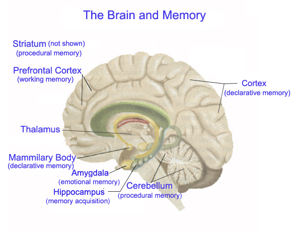

# Content

- Introduction 
- Applied Mathematics using Numpy
    - General Term in Maths
    - Introduction to Numpy
    - Linear Algebra
    - Probability and Statistics
    - Numerial Computation
- ML Algorithms
- Intro to Deep Learning 
- Getting Started with Pytorch
- Natural Language Processing with Pytorch
- Intro into RNN
- Transfer Learning with Pytorch
- EDA and Feature Engg with Python

## Introduction 

We are a species who are highly intelligent capable of turning events. We can make war, we can make coffee and start a revolution. Time in its very essence has revealed invaluable secrets to human beings about its nature which has allowed us to evolve and hence made us greater than any other species around us. The capabilities of human beings are just expanding, from creating a wheel to splitting the atom, we have seen everything that makes up a species like us. And now we are aiming for the stars.

Our intelligence is expanding at an incredible rate. The thought of what we can do relies on the deepest part of our brain. At one point we are aimless, with no purpose in our lives -- we feel contempt about ourselves, we feel invaluable -- but other times we are as strong like never before. Our intelligence is completely different from what we feel, the ground truth is we have a system build inside of us that has invaluable information stored within itself. It is only a matter of choosing. Once we choose to rely on the truth, we can unravel all the mysteries of the universe.
Being intelligent is all about attaining skills and knowledge to make a decision and comprehend the world in all its beauty. 

Our brain is one of the most important parts of our body. But, why it is important? I believe because they can **observe, store, think and make decisions**.

The brain is one of the most complex organs in a human system. It carefully observes all the information and stores it inside of it. Memories aren’t stored in just one part of the brain. Different types are stored across different, interconnected brain regions. For explicit memories – which are about events that happened to you (episodic), as well as general facts and information (semantic) – there are three important areas of the brain: **the hippocampus, the neocortex and the amygdala**. Implicit memories, such as motor memories, rely on **the basal ganglia and cerebellum**. Short-term working memory relies most heavily on the **prefrontal cortex**.

The role of a brain in a human system is not limited to observing and storing information but far more than that. It controls the whole human system. Right from the eyes to the ears, our heart, our lungs, every part is controlled by the brain. Its main function is to survive, evolve and add meaning to life. Besides talking about the subconscious, the brain has played in the major part for the survival of the Human race.

**But what if we can replicate the brain outside the Human system?**
Yes, we can. Welcome to **Artificial Intelligence**.

What is **Artificial Intelligence**?

It is derived from two words **Artificial and Intelligence**. Let's break them down.

**Artificial** is something that is not real and which is kind of fake because it is simulated. The simplest thing what I can think of which is artificial grass or even light. Artificial grass is not real grass nor is light, so the latter is kind of fake. It is used to substitute real grass for various reason. Artificial grass is often used for sports because it is more resistant and therefore can be used longer than real grass. It is also easier to care than real grass. And when we talk about artificial light like a bulb or led they can be used whenever we want them to use, unlike sunlight which is wrap-around time and which can only be used when time allows us to use. But that is not the point I want to make. The point is, that there are reasons why some things are artificial and substitute real things.

*"Anything that is inspired by nature and is reproduced by the human being by some fashion or process is own as Artificial."* 

**Intelligence** is a very complex term. It can be defined in many different ways like ***logic, understanding, self-awareness, learning, emotional knowledge, planning, creativity and of course problem-solving**.

We call us, humans, intelligent because we all do these mentioned things. We perceive our environment, learn from it and take action based on what we discovered.

The same applies to animals. The interesting point about intelligence on animals is, that there are many different species and because of that we can compare intelligence on between species.

In both cases -- human intelligence and animal intelligence -- we talk about **Natural intelligence**.

Next to humans and animals there has been argued about **plant intelligence**. Intelligence in plants shows off the kind of different from humans or animals. The main reason is here that plants are not having a brain or neuronal network, but they react to their environment. Plant intelligence is a very interesting topic on its own because plant intelligence is not instantly visible through reactions through movement or lute.

But, one question arises. If both animal and human beings have brains then why do human being stand on top of the evolutionary cycle?

The answer I got while reading a book called **'Homo Deus'** by Noah Yuval Harari. He mentioned that "*Humans nowadays completely dominate the planet not because the individual human is far smarter and more nimble-fingered than the individual chimp or wolf, but because Homo sapiens is the only species on earth capable of cooperating flexibly in large numbers. Intelligence and toolmaking were very important as well. But if humans had not learned to cooperate flexibly in large numbers, our crafty brains and deft hands would still be splitting flint stones rather than uranium atoms"*.

Coming back to our topic. We should keep in mind that if we talk about Artificial Intelligence (AI) we refer to a subfield of Computer Science. 

“Within a generation … the problem of creating ‘artificer intelligence’ will substantially be solved” – Marvin Minsky (MIT)

## Inspirations
This Program is inspired by (Make sure you read in the order mentioned below in order to get an intuitive knowledge of the subject. Let's Build the Intuition) :

    - Machine Learning for Humans by Vishal Saini and Samir Sabri
    - The Hundred-Page Machine Learning Book by Andriy Burkov
    - An Introduction to Statistical Learning - Gareth James Daniela Witten Trevor Hastie Robert Tibshirani
    - Coursera Deep Learning Course by Andrew Ng
    - Deep Learning by Ian Goodfellow and Yoshua Bengio and Aaron Courville
    - Artificial Intelligence: A Modern Approach
    - Pattern Recognition and Machine Learning by Christopher M.Bishop
    
 Additional Reading:
 
    - Homo Deus by Yuval Noah Harari
    - Machine Who Think by Pamela Mccorduck
    

